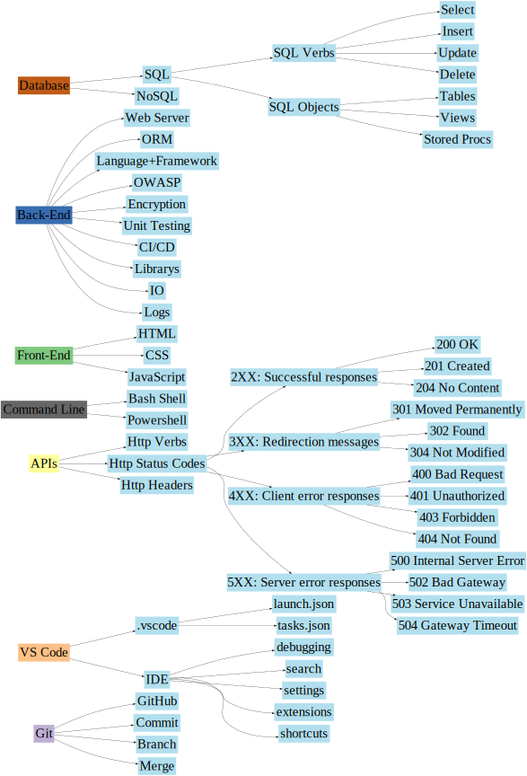
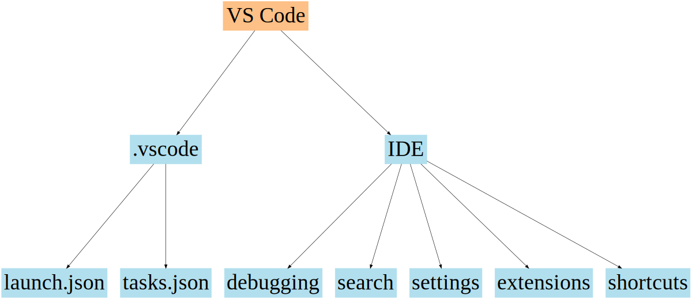
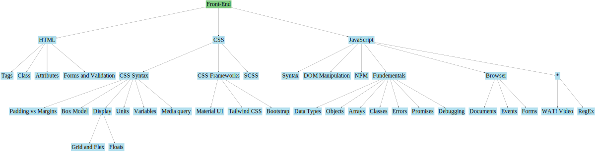
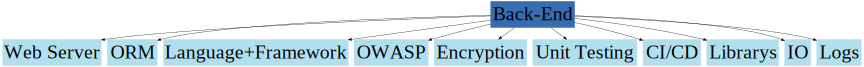
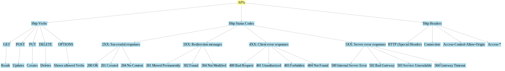
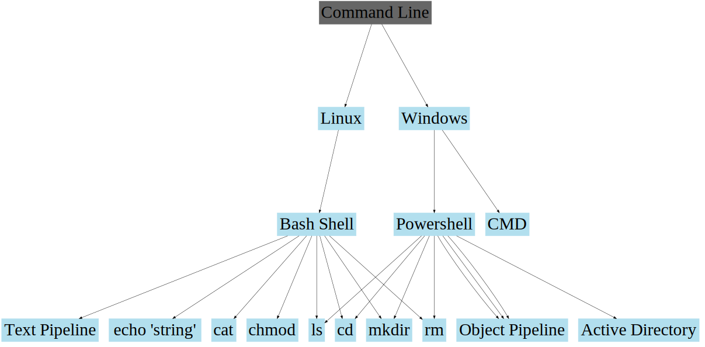

    
# Mern Stack Tutor

What stack should I learn first?
MERN because you only need to learn 1 language to do all 3 major parts of web app: Front End, BackEnd and Database

What is the MERN Stack?
MERN stands for MongoDB, Express, React, Node, after the four key technologies that make up the stack.

* MongoDB - javascript-based document database
* Express(.js) - Node.js  web framework
* React(.js) - a Frontend(client-side) JavaScript framework
* Node(.js) - the premier JavaScript web server

You can transition easiliy to other tech.

Learn TypeScript? Replace React for Angular to be the MEAN Stack.
Learn a different database? No problem! 
Learn nginx, iis, apache or another web server? Migrating is a little difficult but a good experience. 

## Dev Skills Needed:

https://www.freecodecamp.org/news/how-to-learn-web-dev-in-2021-roadmap/

[](https://dreampuf.github.io/GraphvizOnline/#digraph%20devskills%20%7B%0A%20%20%20%20size%3D%2212%2C12%22%3B%0A%20%20%20%20node%20%5Bcolorscheme%3Daccent8%2C%20style%3Dfilled%2C%20ordering%3Dout%2C%20color%3Dlightblue2%2C%20fontsize%3D60%2C%20shape%3Dbox%5D%3B%0A%20%20%20%20rankdir%20%3D%20LR%3B%0A%20%20%20%20%2F%2F%22Dev%20Skills%22%20-%3E%20%22Git%22%3B%0A%20%20%20%20%2F%2F%22Dev%20Skills%22%20-%3E%20%22VS%20Code%22%3B%0A%20%20%20%20%2F%2F%22Dev%20Skills%22%20-%3E%20%22APIs%22%3B%0A%20%20%20%20%2F%2F%22Dev%20Skills%22%20-%3E%20%22Front-End%22%3B%0A%20%20%20%20%2F%2F%22Dev%20Skills%22%20-%3E%20%22Back-End%22%3B%0A%20%20%20%20%2F%2F%22Dev%20Skills%22%20-%3E%20%22Command%20Line%22%3B%0A%20%20%20%20%2F%2F%22Dev%20Skills%22%20-%3E%20%22Database%22%3B%0A%0A%20%20%20%20subgraph%20git%20%7B%0A%20%20%20%20%20%20%20%20%22Git%22%20%5Bcolor%3D%222%22%5D%3B%0A%20%20%20%20%20%20%20%20%22Git%22%20-%3E%20%22GitHub%22%3B%0A%20%20%20%20%20%20%20%20%22Git%22%20-%3E%20%22Commit%22%3B%0A%20%20%20%20%20%20%20%20%22Git%22%20-%3E%20%22Branch%22%3B%0A%20%20%20%20%20%20%20%20%22Git%22%20-%3E%20%22Merge%22%3B%0A%09%7D%0A%20%20%20%20%0A%20%20%20%20subgraph%20vscode%20%7B%0A%20%20%20%20%20%20%20%20%22VS%20Code%22%20%5Bcolor%3D%223%22%5D%3B%0A%20%20%20%20%20%20%20%20%22VS%20Code%22%20-%3E%20%22.vscode%22%3B%0A%20%20%20%20%20%20%20%20%22VS%20Code%22%20-%3E%20%22IDE%22%3B%0A%20%20%20%20%20%20%20%20%22IDE%22%20-%3E%20%22debugging%22%3B%0A%20%20%20%20%20%20%20%20%22IDE%22%20-%3E%20%22search%22%3B%0A%20%20%20%20%20%20%20%20%22IDE%22%20-%3E%20%22settings%22%3B%0A%20%20%20%20%20%20%20%20%22IDE%22%20-%3E%20%22extensions%22%3B%0A%20%20%20%20%20%20%20%20%22IDE%22%20-%3E%20%22shortcuts%22%3B%0A%20%20%20%20%20%20%20%20%22.vscode%22%20-%3E%20%22launch.json%22%3B%0A%20%20%20%20%20%20%20%20%22.vscode%22%20-%3E%20%22tasks.json%22%3B%0A%09%7D%0A%20%20%20%20%0A%20%20%20%20subgraph%20apis%20%7B%0A%20%20%20%20%20%20%20%20%22APIs%22%20%5Bcolor%3D%224%22%5D%3B%0A%20%20%20%20%20%20%20%20%22APIs%22%20-%3E%20%22Http%20Verbs%22%3B%0A%20%20%20%20%20%20%20%20%22APIs%22%20-%3E%20%22Http%20Status%20Codes%22%3B%0A%20%20%20%20%20%20%20%20%22APIs%22%20-%3E%20%22Http%20Headers%22%0A%20%20%20%20%20%20%20%20%0A%20%20%20%20%20%20%20%20%22Http%20Status%20Codes%22%20-%3E%20%222XX%3A%20Successful%20responses%22%3B%0A%20%20%20%20%20%20%20%20%22Http%20Status%20Codes%22%20-%3E%20%223XX%3A%20Redirection%20messages%22%3B%0A%20%20%20%20%20%20%20%20%22Http%20Status%20Codes%22%20-%3E%20%224XX%3A%20Client%20error%20responses%22%3B%0A%20%20%20%20%20%20%20%20%22Http%20Status%20Codes%22%20-%3E%20%225XX%3A%20Server%20error%20responses%22%3B%0A%20%20%20%20%20%20%20%20%0A%20%20%20%20%20%20%20%20%222XX%3A%20Successful%20responses%22%20-%3E%20%22200%20OK%22%3B%0A%20%20%20%20%20%20%20%20%222XX%3A%20Successful%20responses%22%20-%3E%20%22201%20Created%22%3B%0A%20%20%20%20%20%20%20%20%222XX%3A%20Successful%20responses%22%20-%3E%20%22204%20No%20Content%22%3B%0A%20%20%20%20%20%20%20%20%0A%20%20%20%20%20%20%20%20%223XX%3A%20Redirection%20messages%22%20-%3E%20%22301%20Moved%20Permanently%22%3B%0A%20%20%20%20%20%20%20%20%223XX%3A%20Redirection%20messages%22%20-%3E%20%22302%20Found%22%3B%0A%20%20%20%20%20%20%20%20%223XX%3A%20Redirection%20messages%22%20-%3E%20%22304%20Not%20Modified%22%3B%0A%20%20%20%20%20%20%20%20%0A%20%20%20%20%20%20%20%20%224XX%3A%20Client%20error%20responses%22%20-%3E%20%22400%20Bad%20Request%22%3B%0A%20%20%20%20%20%20%20%20%224XX%3A%20Client%20error%20responses%22%20-%3E%20%22401%20Unauthorized%22%3B%0A%20%20%20%20%20%20%20%20%224XX%3A%20Client%20error%20responses%22%20-%3E%20%22403%20Forbidden%22%3B%0A%20%20%20%20%20%20%20%20%224XX%3A%20Client%20error%20responses%22%20-%3E%20%22404%20Not%20Found%22%3B%0A%20%20%20%20%20%20%20%20%0A%20%20%20%20%20%20%20%20%225XX%3A%20Server%20error%20responses%22%20-%3E%20%22500%20Internal%20Server%20Error%22%3B%0A%20%20%20%20%20%20%20%20%225XX%3A%20Server%20error%20responses%22%20-%3E%20%22502%20Bad%20Gateway%22%3B%0A%20%20%20%20%20%20%20%20%225XX%3A%20Server%20error%20responses%22%20-%3E%20%22503%20Service%20Unavailable%22%3B%0A%20%20%20%20%20%20%20%20%225XX%3A%20Server%20error%20responses%22%20-%3E%20%22504%20Gateway%20Timeout%22%3B%0A%09%7D%0A%20%20%20%20%0A%20%20%20%20subgraph%20cmd%20%7B%0A%20%20%20%20%20%20%20%20%22Command%20Line%22%20%5Bcolor%3D%228%22%5D%3B%0A%20%20%20%20%20%20%20%20%22Command%20Line%22%20-%3E%20%22Bash%20Shell%22%3B%0A%20%20%20%20%20%20%20%20%22Command%20Line%22%20-%3E%20%22Powershell%22%3B%0A%09%7D%0A%09%0A%09subgraph%20frontend%20%7B%0A%20%20%20%20%20%20%20%20%22Front-End%22%20%5Bcolor%3D%221%22%5D%3B%0A%20%20%20%20%20%20%20%20%22Front-End%22%20-%3E%20%22HTML%22%0A%20%20%20%20%20%20%20%20%22Front-End%22%20-%3E%20%22CSS%22%0A%20%20%20%20%20%20%20%20%22Front-End%22%20-%3E%20%22JavaScript%22%0A%09%7D%0A%20%20%20%20%0A%20%20%20%20subgraph%20backend%20%7B%0A%20%20%20%20%20%20%20%20%22Back-End%22%20%5Bcolor%3D%225%22%5D%3B%0A%20%20%20%20%20%20%20%20%22Back-End%22%20-%3E%20%22Web%20Server%22%3B%0A%20%20%20%20%20%20%20%20%22Back-End%22%20-%3E%20%22ORM%22%3B%0A%20%20%20%20%20%20%20%20%22Back-End%22%20-%3E%20%22Language%2BFramework%22%3B%0A%20%20%20%20%20%20%20%20%22Back-End%22%20-%3E%20%22OWASP%22%3B%0A%20%20%20%20%20%20%20%20%22Back-End%22%20-%3E%20%22Encryption%22%3B%0A%20%20%20%20%20%20%20%20%22Back-End%22%20-%3E%20%22Unit%20Testing%22%3B%0A%20%20%20%20%20%20%20%20%22Back-End%22%20-%3E%20%22CI%2FCD%22%3B%0A%20%20%20%20%20%20%20%20%22Back-End%22%20-%3E%20%22Librarys%22%3B%0A%20%20%20%20%20%20%20%20%22Back-End%22%20-%3E%20%22IO%22%3B%0A%20%20%20%20%20%20%20%20%22Back-End%22%20-%3E%20%22Logs%22%3B%0A%09%7D%0A%20%20%20%20%0A%20%20%20%20subgraph%20databse%20%7B%0A%20%20%20%20%20%20%20%20%22Database%22%20%5Bcolor%3D%227%22%5D%3B%0A%20%20%20%20%20%20%20%20%22Database%22%20-%3E%20%22SQL%22%3B%0A%20%20%20%20%20%20%20%20%22Database%22%20-%3E%20%22NoSQL%22%3B%0A%20%20%20%20%20%20%20%20%22SQL%22%20-%3E%20%22SQL%20Verbs%22%3B%0A%20%20%20%20%20%20%20%20%22SQL%22%20-%3E%20%22SQL%20Objects%22%3B%0A%20%20%20%20%20%20%20%20%22SQL%20Verbs%22%20-%3E%20%22Select%22%3B%0A%20%20%20%20%20%20%20%20%22SQL%20Verbs%22%20-%3E%20%22Insert%22%3B%0A%20%20%20%20%20%20%20%20%22SQL%20Verbs%22%20-%3E%20%22Update%22%3B%0A%20%20%20%20%20%20%20%20%22SQL%20Verbs%22%20-%3E%20%22Delete%22%3B%0A%20%20%20%20%20%20%20%20%22SQL%20Objects%22%20-%3E%20%22Tables%22%3B%0A%20%20%20%20%20%20%20%20%22SQL%20Objects%22%20-%3E%20%22Views%22%3B%0A%20%20%20%20%20%20%20%20%22SQL%20Objects%22%20-%3E%20%22Stored%20Procs%22%3B%0A%20%20%20%20%20%20%20%20%0A%09%7D%0A%7D)

[](https://dreampuf.github.io/GraphvizOnline/#digraph%20devskills%20%7B%0A%20%20%20%20size%20%3D%20%2216.66%2C8.33!%22%3B%20%2F%2F%201200x600%20at%2072px%2Fin%2C%20%22!%22%20to%20force%0A%20%20%20%20%2F%2Fratio%20%3D%20%22fill%22%3B%20%0A%20%20%20%20nodesep%3D.5%3B%0A%20%20%20%20ranksep%3D4%3B%0A%20%20%20%20margin%3D0.1%3B%0A%20%20%20%20node%20%5Bcolorscheme%3Daccent8%2C%20style%3Dfilled%2C%20ordering%3Dout%2C%20color%3Dlightblue2%2C%20fontsize%3D60%2C%20shape%3Dbox%5D%3B%0A%20%20%20%20%0A%20%20%20%20subgraph%20databse%20%7B%0A%20%20%20%20%20%20%20%20%22Database%22%20%5Bcolor%3D%227%22%5D%3B%0A%20%20%20%20%20%20%20%20%22Database%22%20-%3E%20%22SQL%22%3B%0A%20%20%20%20%20%20%20%20%22Database%22%20-%3E%20%22NoSQL%22%3B%0A%20%20%20%20%20%20%20%20%22SQL%22%20-%3E%20%22Syntax%22%3B%20%0A%20%20%20%20%20%20%20%20%22Syntax%22%20-%3E%20%22SQL%20Objects%22%3B%0A%20%20%20%20%20%20%20%20%22Syntax%22%20-%3E%20%22SQL%20Operators%22%3B%0A%20%20%20%20%20%20%20%20%22Syntax%22%20-%3E%20%22SQL%20Keywords%22%3B%0A%20%20%20%20%20%20%20%20%22Syntax%22%20-%3E%20%22SQL%20Clauses%22%3B%0A%20%20%20%20%20%20%20%20%22Syntax%22%20-%3E%20%22SQL%20Functions%22%3B%0A%20%20%20%20%20%20%20%20%22SQL%22%20-%3E%20%22Language%20SubTypes%22%0A%20%20%20%20%20%20%20%20%0A%20%20%20%20%20%20%20%20%22Language%20SubTypes%22%20-%3E%20%22DDL%22%3B%0A%20%20%20%20%20%20%20%20%22Language%20SubTypes%22%20-%3E%20%22DML%22%3B%0A%20%20%20%20%20%20%20%20%22Language%20SubTypes%22%20-%3E%20%22DCL%22%3B%0A%20%20%20%20%20%20%20%20%22Language%20SubTypes%22%20-%3E%20%22TCL%22%3B%0A%20%20%20%20%20%20%20%20%0A%20%20%20%20%20%20%20%20%22DCL%22%20-%3E%20%22GRANT%22%3B%0A%20%20%20%20%20%20%20%20%22DCL%22%20-%3E%20%22REVOKE%22%3B%0A%20%20%20%20%20%20%20%20%22TCL%22%20-%3E%20%22COMMIT%22%3B%0A%20%20%20%20%20%20%20%20%22TCL%22%20-%3E%20%22ROLLBACK%22%3B%0A%20%20%20%20%20%20%20%20%22DDL%22%20-%3E%20%22CREATE%22%3B%0A%20%20%20%20%20%20%20%20%22DDL%22%20-%3E%20%22ALTER%22%3B%0A%20%20%20%20%20%20%20%20%22DDL%22%20-%3E%20%22DROP%22%3B%0A%20%20%20%20%20%20%20%20%22DDL%22%20-%3E%20%22TRUNCATE%22%3B%0A%20%20%20%20%20%20%20%20%0A%20%20%20%20%20%20%20%20%22DML%22%20-%3E%20%22SQL%20Verbs%22%0A%20%20%20%20%20%20%20%20%0A%20%20%20%20%20%20%20%20%22SQL%20Functions%22%20-%3E%20%22COUNT()%22%3B%0A%20%20%20%20%20%20%20%20%22SQL%20Functions%22%20-%3E%20%22AVG()%22%3B%0A%20%20%20%20%20%20%20%20%22SQL%20Functions%22%20-%3E%20%22SUM()%22%3B%0A%20%20%20%20%20%20%20%20%0A%20%20%20%20%20%20%20%20%22SQL%20Keywords%22%20-%3E%20%22ORDER%20BY%22%3B%0A%20%20%20%20%20%20%20%20%22ORDER%20BY%22%20-%3E%20%22ASC%20VS%20DESC%22%0A%20%20%20%20%20%20%20%20%22SQL%20Keywords%22%20-%3E%20%22AS%20(Alias%20a%20Column)%22%3B%0A%20%20%20%20%20%20%20%20%22SQL%20Operators%22%20-%3E%20%22Like%22%3B%0A%20%20%20%20%20%20%20%20%22SQL%20Operators%22%20-%3E%20%22In%22%3B%0A%20%20%20%20%20%20%20%20%0A%20%20%20%20%20%20%20%20%22SQL%20Clauses%22%20-%3E%20%22Where%22%3B%0A%20%20%20%20%20%20%20%20%22SQL%20Clauses%22%20-%3E%20%22Joins%22%3B%0A%20%20%20%20%20%20%20%20%0A%20%20%20%20%20%20%20%20%22Joins%22%20-%3E%20%22Left%20vs%20Right%22%3B%0A%20%20%20%20%20%20%20%20%22Joins%22%20-%3E%20%22Inner%20vs%20Outer%22%3B%0A%20%20%20%20%20%20%20%20%22Joins%22%20-%3E%20%22Self%20Join%22%3B%0A%20%20%20%20%20%20%20%20%22SQL%20Clauses%22%20-%3E%20%22Where%20Clause%22%3B%0A%20%20%20%20%20%20%20%20%22SQL%20Clauses%22%20-%3E%20%22Union%20Clause%22%3B%0A%20%20%20%20%20%20%20%20%22SQL%20Clauses%22%20-%3E%20%22Having%20Clause%22%3B%0A%20%20%20%20%20%20%20%20%22SQL%20Verbs%22%20-%3E%20%22Select%22%3B%0A%20%20%20%20%20%20%20%20%22SQL%20Verbs%22%20-%3E%20%22Insert%22%3B%0A%20%20%20%20%20%20%20%20%22SQL%20Verbs%22%20-%3E%20%22Update%22%3B%0A%20%20%20%20%20%20%20%20%22SQL%20Verbs%22%20-%3E%20%22Delete%22%3B%0A%20%20%20%20%20%20%20%20%22SQL%20Verbs%22%20-%3E%20%22Upsert%22%3B%0A%20%20%20%20%20%20%20%20%22Select%22%20-%3E%20%22Distinct%22%3B%0A%20%20%20%20%20%20%20%20%22SQL%20Objects%22%20-%3E%20%22Tables%22%3B%0A%20%20%20%20%20%20%20%20%22SQL%20Objects%22%20-%3E%20%22Views%22%3B%0A%20%20%20%20%20%20%20%20%22SQL%20Objects%22%20-%3E%20%22Stored%20Procs%22%3B%0A%20%20%20%20%20%20%20%20%0A%20%20%20%20%20%20%20%20%22NoSQL%22%20-%3E%20%22Schema-less%22%3B%0A%20%20%20%20%20%20%20%20%22NoSQL%22%20-%3E%20%22Non-relational%22%3B%0A%20%20%20%20%20%20%20%20%22NoSQL%22%20-%3E%20%22cluster-friendly%22%3B%0A%20%20%20%20%20%20%20%20%22NoSQL%22%20-%3E%20%22BASE%22%3B%0A%20%20%20%20%20%20%20%20%0A%20%20%20%20%20%20%20%20%22BASE%22%20-%3E%20%22Basically%20Available%22%3B%0A%20%20%20%20%20%20%20%20%22Basically%20Available%22%20-%3E%20%22Soft%20state%22%3B%0A%20%20%20%20%20%20%20%20%22Soft%20state%22%20-%3E%20%22Eventual%20consistency%22%3B%0A%20%20%20%20%20%20%20%20%0A%09%7D%0A%7D)

[](https://dreampuf.github.io/GraphvizOnline/#digraph%20devskills%20%7B%0A%20%20%20%20size%20%3D%20%2216.66%2C8.33!%22%3B%20%2F%2F%201200x600%20at%2072px%2Fin%2C%20%22!%22%20to%20force%0A%20%20%20%20%2F%2Fratio%20%3D%20%22fill%22%3B%20%0A%20%20%20%20nodesep%3D.5%3B%0A%20%20%20%20ranksep%3D4%3B%0A%20%20%20%20margin%3D0.1%3B%0A%20%20%20%20node%20%5Bcolorscheme%3Daccent8%2C%20style%3Dfilled%2C%20ordering%3Dout%2C%20color%3Dlightblue2%2C%20fontsize%3D60%2C%20shape%3Dbox%5D%3B%0A%0A%20%20%20%20%0A%20%20%20%20subgraph%20vscode%20%7B%0A%20%20%20%20%20%20%20%20%22VS%20Code%22%20%5Bcolor%3D%223%22%5D%3B%0A%20%20%20%20%20%20%20%20%22VS%20Code%22%20-%3E%20%22.vscode%22%3B%0A%20%20%20%20%20%20%20%20%22VS%20Code%22%20-%3E%20%22IDE%22%3B%0A%20%20%20%20%20%20%20%20%22IDE%22%20-%3E%20%22debugging%22%3B%0A%20%20%20%20%20%20%20%20%22IDE%22%20-%3E%20%22search%22%3B%0A%20%20%20%20%20%20%20%20%22IDE%22%20-%3E%20%22settings%22%3B%0A%20%20%20%20%20%20%20%20%22IDE%22%20-%3E%20%22extensions%22%3B%0A%20%20%20%20%20%20%20%20%22IDE%22%20-%3E%20%22shortcuts%22%3B%0A%20%20%20%20%20%20%20%20%22.vscode%22%20-%3E%20%22launch.json%22%3B%0A%20%20%20%20%20%20%20%20%22.vscode%22%20-%3E%20%22tasks.json%22%3B%0A%09%7D%0A%7D)

[](https://dreampuf.github.io/GraphvizOnline/#digraph%20devskills%20%7B%0A%20%20%20%20size%20%3D%20%2216.66%2C8.33!%22%3B%20%2F%2F%201200x600%20at%2072px%2Fin%2C%20%22!%22%20to%20force%0A%20%20%20%20%2F%2Fratio%20%3D%20%22fill%22%3B%20%0A%20%20%20%20nodesep%3D.5%3B%0A%20%20%20%20ranksep%3D4%3B%0A%20%20%20%20margin%3D0.1%3B%0A%20%20%20%20node%20%5Bcolorscheme%3Daccent8%2C%20style%3Dfilled%2C%20ordering%3Dout%2C%20color%3Dlightblue2%2C%20fontsize%3D60%2C%20shape%3Dbox%5D%3B%0A%09%0A%09subgraph%20frontend%20%7B%0A%20%20%20%20%20%20%20%20%22Front-End%22%20%5Bcolor%3D%221%22%5D%3B%0A%20%20%20%20%20%20%20%20%22Front-End%22%20-%3E%20%22HTML%22%0A%20%20%20%20%20%20%20%20%22Front-End%22%20-%3E%20%22CSS%22%0A%20%20%20%20%20%20%20%20%22Front-End%22%20-%3E%20%22JavaScript%22%0A%20%20%20%20%20%20%20%20%0A%20%20%20%20%20%20%20%20%22HTML%22%20-%3E%20%22Tags%22%3B%0A%20%20%20%20%20%20%20%20%22HTML%22%20-%3E%20%22Class%22%3B%0A%20%20%20%20%20%20%20%20%22HTML%22%20-%3E%20%22Attributes%22%3B%0A%20%20%20%20%20%20%20%20%22HTML%22%20-%3E%20%22Forms%20and%20Validation%22%3B%0A%20%20%20%20%20%20%20%20%0A%20%20%20%20%20%20%20%20%22CSS%22%20-%3E%20%22CSS%20Syntax%22%0A%20%20%20%20%20%20%20%20%0A%20%20%20%20%20%20%20%20%22CSS%20Syntax%22%20-%3E%20%22Padding%20vs%20Margins%22%3B%0A%20%20%20%20%20%20%20%20%22CSS%20Syntax%22%20-%3E%20%22Box%20Model%22%3B%0A%20%20%20%20%20%20%20%20%22CSS%20Syntax%22%20-%3E%20%22Display%22%3B%0A%20%20%20%20%20%20%20%20%22CSS%22%20-%3E%20%22CSS%20Frameworks%22%3B%0A%20%20%20%20%20%20%20%20%22CSS%20Syntax%22%20-%3E%20%22Units%22%3B%0A%20%20%20%20%20%20%20%20%22CSS%20Syntax%22%20-%3E%20%22Variables%22%3B%0A%20%20%20%20%20%20%20%20%22CSS%20Syntax%22%20-%3E%20%22Media%20query%22%3B%0A%20%20%20%20%20%20%20%20%22CSS%22%20-%3E%20%22SCSS%22%0A%20%20%20%20%20%20%20%20%0A%20%20%20%20%20%20%20%20%22Display%22%20-%3E%20%22Grid%20and%20Flex%22%3B%0A%20%20%20%20%20%20%20%20%22Display%22%20-%3E%20%22Floats%22%3B%0A%20%20%20%20%20%20%20%20%22CSS%20Frameworks%22%20-%3E%20%22Material%20UI%22%3B%0A%20%20%20%20%20%20%20%20%22CSS%20Frameworks%22%20-%3E%20%22Tailwind%20CSS%22%3B%0A%20%20%20%20%20%20%20%20%22CSS%20Frameworks%22%20-%3E%20%22Bootstrap%22%3B%0A%20%20%20%20%20%20%20%20%0A%20%20%20%20%20%20%20%20%22*%22%20-%3E%20%22WAT!%20Video%22%3B%0A%20%20%20%20%20%20%20%20%22JavaScript%22%20-%3E%20%22Syntax%22%3B%0A%20%20%20%20%20%20%20%20%22JavaScript%22%20-%3E%20%22DOM%20Manipulation%22%3B%0A%20%20%20%20%20%20%20%20%22JavaScript%22%20-%3E%20%22NPM%22%3B%0A%20%20%20%20%20%20%20%20%22JavaScript%22%20-%3E%20%22Fundementals%22%3B%0A%20%20%20%20%20%20%20%20%22JavaScript%22%20-%3E%20%22Browser%22%3B%0A%20%20%20%20%20%20%20%20%22JavaScript%22%20-%3E%20%22*%22%3B%0A%20%20%20%20%20%20%20%20%0A%20%20%20%20%20%20%20%20%22*%22%20-%3E%20%22RegEx%22%3B%0A%20%20%20%20%20%20%20%20%0A%20%20%20%20%20%20%20%20%0A%20%20%20%20%20%20%20%20%22Fundementals%22%20-%3E%20%22Data%20Types%22%3B%0A%20%20%20%20%20%20%20%20%22Fundementals%22%20-%3E%20%22Objects%22%3B%0A%20%20%20%20%20%20%20%20%22Fundementals%22%20-%3E%20%22Arrays%22%3B%0A%20%20%20%20%20%20%20%20%22Fundementals%22%20-%3E%20%22Classes%22%3B%0A%20%20%20%20%20%20%20%20%22Fundementals%22%20-%3E%20%22Errors%22%3B%0A%20%20%20%20%20%20%20%20%22Fundementals%22%20-%3E%20%22Promises%22%3B%0A%20%20%20%20%20%20%20%20%0A%20%20%20%20%20%20%20%20%22Browser%22%20-%3E%20%22Documents%22%3B%0A%20%20%20%20%20%20%20%20%22Browser%22%20-%3E%20%22Events%22%3B%0A%20%20%20%20%20%20%20%20%22Browser%22%20-%3E%20%22Forms%22%3B%0A%20%20%20%20%20%20%20%20%22Fundementals%22%20-%3E%20%22Debugging%22%3B%0A%09%7D%0A%7D)

[](https://dreampuf.github.io/GraphvizOnline/#digraph%20devskills%20%7B%0A%20%20%20%20size%3D%2212%2C12%22%3B%0A%20%20%20%20node%20%5Bcolorscheme%3Daccent8%2C%20style%3Dfilled%2C%20ordering%3Dout%2C%20color%3Dlightblue2%2C%20fontsize%3D60%2C%20shape%3Dbox%5D%3B%0A%20%20%20%20%0A%20%20%20%20subgraph%20backend%20%7B%0A%20%20%20%20%20%20%20%20%22Back-End%22%20%5Bcolor%3D%225%22%5D%3B%0A%20%20%20%20%20%20%20%20%22Back-End%22%20-%3E%20%22Web%20Server%22%3B%0A%20%20%20%20%20%20%20%20%22Back-End%22%20-%3E%20%22ORM%22%3B%0A%20%20%20%20%20%20%20%20%22Back-End%22%20-%3E%20%22Language%2BFramework%22%3B%0A%20%20%20%20%20%20%20%20%22Back-End%22%20-%3E%20%22OWASP%22%3B%0A%20%20%20%20%20%20%20%20%22Back-End%22%20-%3E%20%22Encryption%22%3B%0A%20%20%20%20%20%20%20%20%22Back-End%22%20-%3E%20%22Unit%20Testing%22%3B%0A%20%20%20%20%20%20%20%20%22Back-End%22%20-%3E%20%22CI%2FCD%22%3B%0A%20%20%20%20%20%20%20%20%22Back-End%22%20-%3E%20%22Librarys%22%3B%0A%20%20%20%20%20%20%20%20%22Back-End%22%20-%3E%20%22IO%22%3B%0A%20%20%20%20%20%20%20%20%22Back-End%22%20-%3E%20%22Logs%22%3B%0A%09%7D%0A%7D)

[](https://dreampuf.github.io/GraphvizOnline/#digraph%20devskills%20%7B%0A%20%20%20%20size%20%3D%20%2216.66%2C8.33!%22%3B%20%2F%2F%201200x600%20at%2072px%2Fin%2C%20%22!%22%20to%20force%0A%20%20%20%20%2F%2Fratio%20%3D%20%22fill%22%3B%20%0A%20%20%20%20nodesep%3D.5%3B%0A%20%20%20%20ranksep%3D4%3B%0A%20%20%20%20margin%3D0.1%3B%0A%20%20%20%20node%20%5Bcolorscheme%3Daccent8%2C%20style%3Dfilled%2C%20ordering%3Dout%2C%20color%3Dlightblue2%2C%20fontsize%3D60%2C%20shape%3Dbox%5D%3B%0A%20%20%20%20%0A%20%20%20%20subgraph%20apis%20%7B%0A%20%20%20%20%20%20%20%20%22APIs%22%20%5Bcolor%3D%224%22%5D%3B%0A%20%20%20%20%20%20%20%20%22APIs%22%20-%3E%20%22Http%20Verbs%22%3B%0A%20%20%20%20%20%20%20%20%22APIs%22%20-%3E%20%22Http%20Status%20Codes%22%3B%0A%20%20%20%20%20%20%20%20%22APIs%22%20-%3E%20%22Http%20Headers%22%3B%0A%20%20%20%20%20%20%20%20%0A%20%20%20%20%20%20%20%20%22Http%20Headers%22%20-%3E%20%22HTTP%20(Special%20Header)%22%3B%0A%20%20%20%20%20%20%20%20%22Http%20Headers%22%20-%3E%20%22Connection%22%3B%0A%20%20%20%20%20%20%20%20%22Http%20Headers%22%20-%3E%20%22Access-Control-Allow-Origin%22%3B%0A%20%20%20%20%20%20%20%20%22Http%20Headers%22%20-%3E%20%22Access-*%22%3B%0A%20%20%20%20%20%20%20%20%0A%20%20%20%20%20%20%20%20%22Http%20Verbs%22%20-%3E%20%22GET%22%3B%0A%20%20%20%20%20%20%20%20%22Http%20Verbs%22%20-%3E%20%22POST%22%3B%0A%20%20%20%20%20%20%20%20%22Http%20Verbs%22%20-%3E%20%22PUT%22%3B%0A%20%20%20%20%20%20%20%20%22Http%20Verbs%22%20-%3E%20%22DELETE%22%3B%0A%20%20%20%20%20%20%20%20%22Http%20Verbs%22%20-%3E%20%22OPTIONS%22%3B%0A%20%20%20%20%20%20%20%20%0A%20%20%20%20%20%20%20%20%22GET%22%20-%3E%20%22Reads%22%3B%0A%20%20%20%20%20%20%20%20%22POST%22%20-%3E%20%22Updates%22%3B%0A%20%20%20%20%20%20%20%20%22PUT%22%20-%3E%20%22Creates%22%3B%0A%20%20%20%20%20%20%20%20%22DELETE%22%20-%3E%20%22Deletes%22%3B%0A%20%20%20%20%20%20%20%20%22OPTIONS%22%20-%3E%20%22Shows%20allowed%20Verbs%22%0A%20%20%20%20%20%20%20%20%0A%20%20%20%20%20%20%20%20%22Http%20Status%20Codes%22%20-%3E%20%222XX%3A%20Successful%20responses%22%3B%0A%20%20%20%20%20%20%20%20%22Http%20Status%20Codes%22%20-%3E%20%223XX%3A%20Redirection%20messages%22%3B%0A%20%20%20%20%20%20%20%20%22Http%20Status%20Codes%22%20-%3E%20%224XX%3A%20Client%20error%20responses%22%3B%0A%20%20%20%20%20%20%20%20%22Http%20Status%20Codes%22%20-%3E%20%225XX%3A%20Server%20error%20responses%22%3B%0A%20%20%20%20%20%20%20%20%0A%20%20%20%20%20%20%20%20%222XX%3A%20Successful%20responses%22%20-%3E%20%22200%20OK%22%3B%0A%20%20%20%20%20%20%20%20%222XX%3A%20Successful%20responses%22%20-%3E%20%22201%20Created%22%3B%0A%20%20%20%20%20%20%20%20%222XX%3A%20Successful%20responses%22%20-%3E%20%22204%20No%20Content%22%3B%0A%20%20%20%20%20%20%20%20%0A%20%20%20%20%20%20%20%20%223XX%3A%20Redirection%20messages%22%20-%3E%20%22301%20Moved%20Permanently%22%3B%0A%20%20%20%20%20%20%20%20%223XX%3A%20Redirection%20messages%22%20-%3E%20%22302%20Found%22%3B%0A%20%20%20%20%20%20%20%20%223XX%3A%20Redirection%20messages%22%20-%3E%20%22304%20Not%20Modified%22%3B%0A%20%20%20%20%20%20%20%20%0A%20%20%20%20%20%20%20%20%224XX%3A%20Client%20error%20responses%22%20-%3E%20%22400%20Bad%20Request%22%3B%0A%20%20%20%20%20%20%20%20%224XX%3A%20Client%20error%20responses%22%20-%3E%20%22401%20Unauthorized%22%3B%0A%20%20%20%20%20%20%20%20%224XX%3A%20Client%20error%20responses%22%20-%3E%20%22403%20Forbidden%22%3B%0A%20%20%20%20%20%20%20%20%224XX%3A%20Client%20error%20responses%22%20-%3E%20%22404%20Not%20Found%22%3B%0A%20%20%20%20%20%20%20%20%0A%20%20%20%20%20%20%20%20%225XX%3A%20Server%20error%20responses%22%20-%3E%20%22500%20Internal%20Server%20Error%22%3B%0A%20%20%20%20%20%20%20%20%225XX%3A%20Server%20error%20responses%22%20-%3E%20%22502%20Bad%20Gateway%22%3B%0A%20%20%20%20%20%20%20%20%225XX%3A%20Server%20error%20responses%22%20-%3E%20%22503%20Service%20Unavailable%22%3B%0A%20%20%20%20%20%20%20%20%225XX%3A%20Server%20error%20responses%22%20-%3E%20%22504%20Gateway%20Timeout%22%3B%0A%09%7D%0A%7D)

[](https://dreampuf.github.io/GraphvizOnline/#digraph%20devskills%20%7B%0A%20%20%20%20size%20%3D%20%2216.66%2C8.33!%22%3B%20%2F%2F%201200x600%20at%2072px%2Fin%2C%20%22!%22%20to%20force%0A%20%20%20%20%2F%2Fratio%20%3D%20%22fill%22%3B%20%0A%20%20%20%20nodesep%3D.5%3B%0A%20%20%20%20ranksep%3D4%3B%0A%20%20%20%20margin%3D0.1%3B%0A%20%20%20%20node%20%5Bcolorscheme%3Daccent8%2C%20style%3Dfilled%2C%20ordering%3Dout%2C%20color%3Dlightblue2%2C%20fontsize%3D60%2C%20shape%3Dbox%5D%3B%0A%0A%20%20%20%20%0A%20%20%20%20subgraph%20cmd%20%7B%0A%20%20%20%20%20%20%20%20%22Command%20Line%22%20%5Bcolor%3D%228%22%5D%3B%0A%20%20%20%20%20%20%20%20%0A%20%20%20%20%20%20%20%20%22Command%20Line%22%20-%3E%20%22Linux%22%3B%0A%20%20%20%20%20%20%20%20%22Command%20Line%22%20-%3E%20%22Windows%22%3B%0A%20%20%20%20%20%20%20%20%0A%20%20%20%20%20%20%20%20%0A%20%20%20%20%20%20%20%20%22Windows%22%20-%3E%20%22Powershell%22%3B%0A%20%20%20%20%20%20%20%20%22Windows%22%20-%3E%20%22CMD%22%3B%0A%20%20%20%20%20%20%20%20%22Linux%22%20-%3E%20%22Bash%20Shell%22%3B%0A%20%20%20%20%20%20%20%20%20%0A%20%20%20%20%20%20%20%20%22Bash%20Shell%22%20-%3E%20%22ls%22%3B%0A%20%20%20%20%20%20%20%20%22Bash%20Shell%22%20-%3E%20%22cd%22%3B%0A%20%20%20%20%20%20%20%20%22Bash%20Shell%22%20-%3E%20%22mkdir%22%3B%0A%20%20%20%20%20%20%20%20%0A%20%20%20%20%20%20%20%20%22Powershell%22%20-%3E%20%22ls%22%3B%0A%20%20%20%20%20%20%20%20%22Powershell%22%20-%3E%20%22cd%22%3B%0A%20%20%20%20%20%20%20%20%22Powershell%22%20-%3E%20%22mkdir%22%3B%0A%20%20%20%20%20%20%20%20%0A%20%20%20%20%20%20%20%20%22Bash%20Shell%22%20-%3E%20%22rm%22%3B%0A%20%20%20%20%20%20%20%20%22Powershell%22%20-%3E%20%22rm%22%3B%0A%20%20%20%20%20%20%20%20%0A%20%20%20%20%20%20%20%20%22Bash%20Shell%22%20-%3E%20%22Text%20Pipeline%22%3B%0A%20%20%20%20%20%20%20%20%22Powershell%22%20-%3E%20%22Object%20Pipeline%22%3B%0A%20%20%20%20%20%20%20%20%0A%20%20%20%20%20%20%20%20%22Bash%20Shell%22%20-%3E%20%22echo%20'string'%22%3B%0A%20%20%20%20%20%20%20%20%22Powershell%22%20-%3E%20%22Object%20Pipeline%22%3B%0A%20%20%20%20%20%20%20%20%0A%20%20%20%20%20%20%20%20%22Bash%20Shell%22%20-%3E%20%22cat%22%3B%0A%20%20%20%20%20%20%20%20%22Powershell%22%20-%3E%20%22Object%20Pipeline%22%3B%0A%20%20%20%20%20%20%20%20%0A%20%20%20%20%20%20%20%20%22Bash%20Shell%22%20-%3E%20%22chmod%22%3B%0A%20%20%20%20%20%20%20%20%22Powershell%22%20-%3E%20%22Active%20Directory%22%0A%09%7D%0A%09%0A%7D)

# Skill 1- Source Control: Git

GitHub is a coding collaboration website, that makes Git easier to use. 
The way git works is it organizes code into repositories or 'repos' which contains all the coding files for a project - kind of like a folder. 
These files are then tracked by git, which checks to see if any of them change. 
If a file changes, you can use a git tool to organize that change or a bunch of unrelated changes in different files into a 'commit' which can then be 'pushed' to a server. 
The good thing about git and GitHub is that they can be accessed from anywhere.
A typical way is for multiple people to clone the repo and work on code. 
When you collaborator pushes their changes to Github, you can get the updates by pulling them.
Git also has usernames, so you can see a history of which file changed, when, what lines changed, and who did it

The Git Guide:
https://rogerdudler.github.io/git-guide/

Article: 
https://medium.com/hackernoon/a-gentle-introduction-to-git-and-github-the-eli5-way-43f0aa64f2e4

Git Explained in 100 Seconds:
https://www.youtube.com/watch?v=hwP7WQkmECE

Git It? How to use Git and Github(12minutes):
https://www.youtube.com/watch?v=HkdAHXoRtos

Interactive Tutorial: 
https://learngitbranching.js.org/

# Git Glossary

* clone - copy a GitHub repo to our local machine
* branch(verb) - To make a new branch thats a copy of the current or specfied branch
* branch(noun) - Branches are like "Save as..." on a directory. 
* fetch - gets latest history from GitHub
* pull - uploading the changes/data from GitHub to our local machine
* push - uploading the changes/data from our local machine to our GitHub repository
* commit - represents a save point for the repo
* hash - In Git’s context, synonym for object name.
* master - the main branch on which your final code is supposed to exist
* merge(verb) - combining 2 branches together as a single commit
* merge(noun) - unless it is a fast-forward, a successful merge results in the creation of a new commit representing the result of the merge, and having as parents the tips of the merged branches. 
* object - The unit of storage in Git - basically a file
* local repository - A repository on your local machine
* remote repository - A repository which is used to track the same project but resides somewhere else. To communicate with remotes, see fetch or push.

[github-glossary](https://docs.github.com/en/github/getting-started-with-github/quickstart/github-glossary)

  
## Authors

- [@TotzkePaul](https://www.github.com/TotzkePaul/)

  